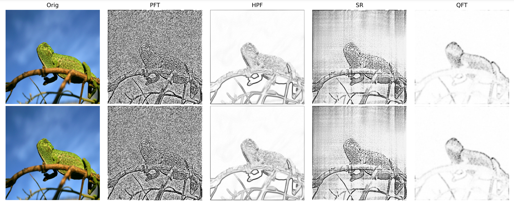

# Semantic feature Extraction on Perturbed Images

To evaluate the effectiveness of frequency domain-based methods in semantic extraction, we investigate the semantic changes caused by adding different perturbations to the samples. Two types of perturbed data were evaluated, including adversarial samples and Out-of-distribution (OOD) samples. 

To generate adversarial samples, we utilized the pre-trained VGG16 model on ImageNet as the under attack model, then we created adversarial samples using the advanced adversarial attack techniques PGD and CW. 

To generate OOD samples, we used widely recognized corrupted benchmarking, which includes 19 types of corruption, involving changes in weather, blur, noise and digital. 

This file present some examples of semantic feature extraction.

## 1. Adversarial attack (Evaluation on adversarial samples) 

### 1.1 PGD attack
Image with lot of textures.

Image with cluttered backgrounds.

Image with single object.

Image with Bright Colors.

Image with flat Colors.

### 1.2 CW attack

## 2. Corruption (Evaluation on OOD samples) 

### 2.1 noise
gaussian_noise

shot_noise

impulse_noise

### 2.2 blur
defocus_blur

glass_blur

motion_blur

zoom_blur

### 2.3 weather
frost

snow

fog

brightness

### 2.4 digital

contrast

elastic_transform

pixelate

jpeg_compression

### 2.5 extra

speckle_noise

spatter

gaussian_blur

saturate
